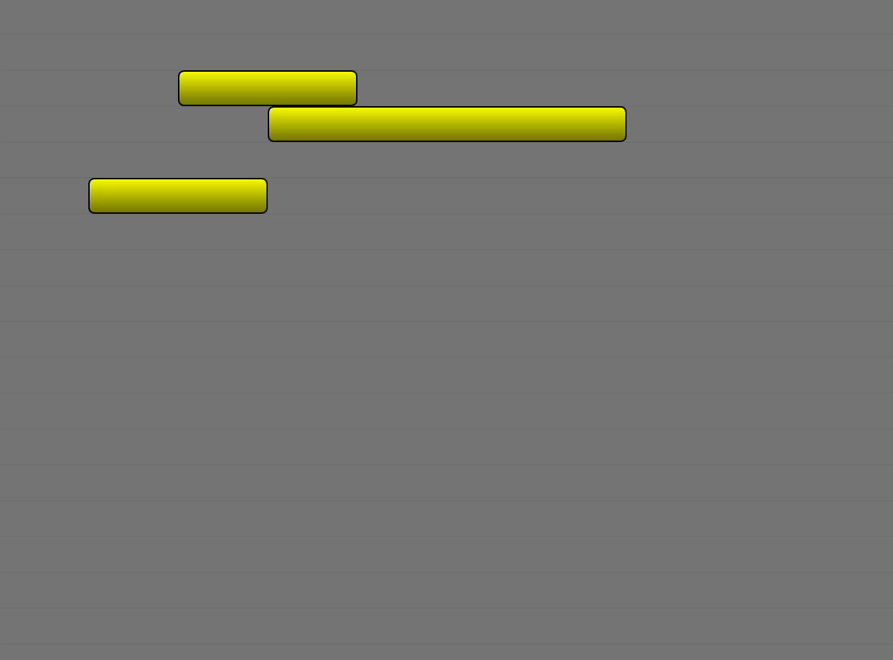

# Qt Quick "Events Timeline" component

A component to show a timeline of events in multiple tracks, that can be modified interactively (move, resize) and can be styled via a delegate.

Usage:

```qml
EventsTimeline {
    id: timeline
    anchors.fill: parent
    eventDelegate: Rectangle {
        gradient: Gradient {
            orientation: Gradient.Vertical
            GradientStop {position: 0; color: 'yellow'}
            GradientStop {position: 1; color: Qt.darker('yellow')}
        }
        border.color: 'black'
        border.width: 1
        radius: 4
    }
}

Component.onCompleted: {
    timeline.add(2, 10, 1, 10)
    timeline.add(3, 15, 1, 20)
    timeline.add(5, 5, 1, 10)
}
```



Author: Federico Ferri
License: [LGPLv3](https://www.gnu.org/licenses/lgpl-3.0.en.html)
